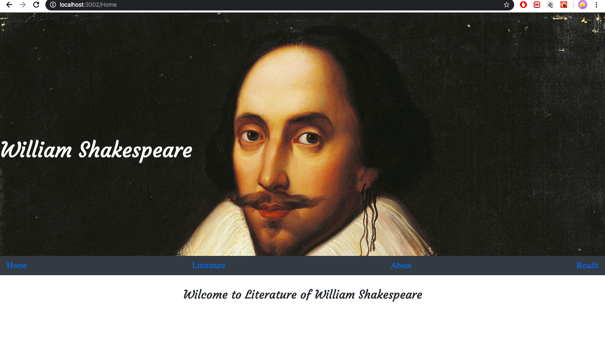
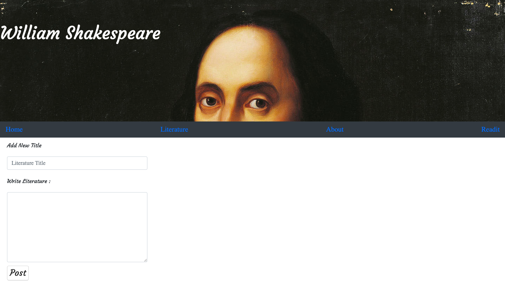
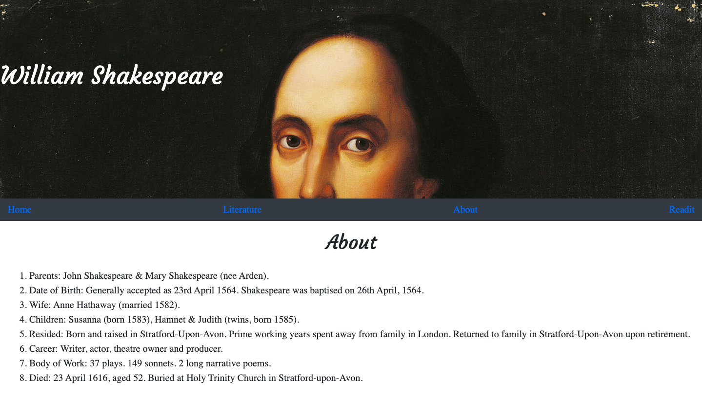
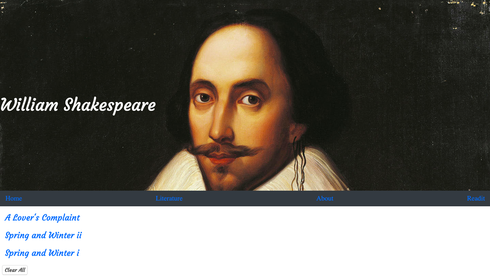

#`This website about` :
The literature of wiliam Shakespeare. The website have wilam’s literature and some information back to him.

#`User story`:

```
1 - As a user , I can click on the title of literature
2 - As a user , I can read it by the button(read it) Click
3 - As a user , I can search about the literature title from a text box whitch is above the page
4 - As a user , when i click on button (read it)it will save automaticlly in another page name’s (read it)
5 - then As a user , I can read the title from (read it) page’s then move to that page i well find the all titles whitch i had add it

6 - As a user , I can delete all the title from that page

7 - As a user , I can add a title and a subject in literature page when he click on (add new) button’s
8- As a user , I can remove one title from Read it page 
```






### unsolved problems

```
Edit an item from a list.
Remove an item from a list.


```


#API From : http://poetrydb.org/index.html
